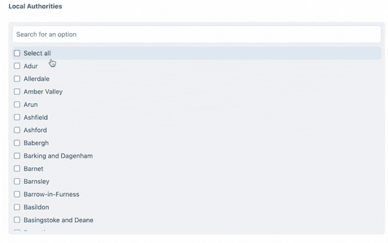

# Tick Box plugin for Craft CMS 4.x

Checkbox list with search functionality

## Requirements

This plugin requires Craft CMS 4.0.0 or later.

## Installation

To install the plugin, follow these instructions.

1. Open your terminal and go to your Craft project:

        cd /path/to/project

2. Then tell Composer to load the plugin:

        composer require percipioglobal/checkbox-search-list

3. In the Control Panel, go to Settings → Plugins and click the “Install” button for Tick Box.

## Tick Box Overview

Do you ever had quite a long list of checkboxes and hard to find the ones you need? Tick Box helps you to make it easier for the editor to find his version or even select / deselect all.

## Configuring Tick Box

You only need to install the plugin and use Tick Box as a field. You will see the options to add, which is exactly the same as the regular Checkbox list from Craft.

## Example of Tick Box

## Tick Box Roadmap

To be announced

Brought to you by [percipio.london](https://percipio.london)
